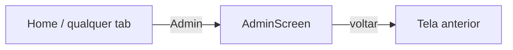

# Tela: Admin — Painel do Administrador

| Campo | Valor |
|-------|-------|
| Arquivo | `lib/screens/admin_screen.dart` |
| Acesso | `AuthService.isAdmin` — tab Admin ou gate |
| Estado capturado | Aba Usuários — 1 registro |
| Screenshot | 2026-05-31 |
| Confiança | 🟢 CONFIRMADO |

## Propósito

Gerenciar usuários (role, conta ativa) e consultar logs de auditoria do Supabase.

## App bar

| Elemento | Descrição |
|----------|-----------|
| Leading | Voltar (seta) |
| Título | **“Painel do Administrador”** — branco |

🟢 Sem bottom navigation nesta tela (full-screen push).

## Tabs

| Tab | Ícone | Estado no screenshot |
|-----|-------|----------------------|
| **Usuários** | `people` | **Ativo** — ícone e label verdes, underline verde |
| Auditoria | `history` / relógio | Inativo — cinza |

## Aba Usuários

### Busca

| Propriedade | Valor |
|-------------|-------|
| Componente | `StreamingSearchField` |
| Placeholder | **“Buscar usuário por e-mail…”** |

### Lista — card de usuário

| Elemento | Descrição |
|----------|-----------|
| Avatar | Círculo verde com silhueta branca |
| Primário | E-mail — ex. `rdinda51@gmail.com` |
| Badge | **“Administrador”** — fundo verde escuro, texto verde claro (`RoleBadge`) |
| Menu | `more_vert` — alterar role, ativar/desativar (código) |

## Aba Auditoria (código, não capturada)

| Elemento | Descrição |
|----------|-----------|
| Filtros | Tabela, intervalo de datas |
| Lista | Entradas `AuditLog` JSON formatado |
| Refresh | Recarrega logs |

## Feedback

- Erros de carga → toast vermelho (`SnackbarUtils` / `toastification`)
- Sucesso em alteração de role → toast verde

## RBAC

| Ação | Requisito |
|------|-----------|
| Abrir tela | `isAdmin` |
| Alterar roles | Admin via `AdminService` + RLS |

## Navegação

