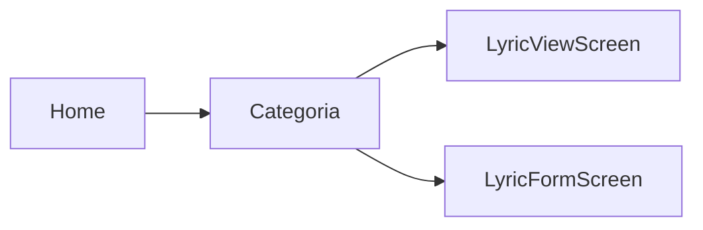

# Tela: Categoria (playlist)

| Campo | Valor |
|-------|-------|
| Arquivo | `lib/screens/category_screen.dart` |
| Scaffold | `StreamingScaffold` (`navContext: category`) |
| Exemplo capturado | Caboclos |
| Estado | Preenchido — 213 pontos |
| Screenshot | 2026-05-31 |
| Confiança | 🟢 CONFIRMADO |

## Propósito

Apresentar o acervo de uma categoria como playlist: hero visual, play all, lista numerada e ações de moderação.

## App bar

| Elemento | Descrição |
|----------|-----------|
| Leading | Voltar verde |
| Título | **“FMA Pontos”** verde central |
| Actions | `edit` e `delete` (quando `canEditCategories` / `canDeleteCategories`) |

## Hero (`_CategoryHero`)

| Elemento | Descrição |
|----------|-----------|
| Arte | Ilustração Caboclo full-bleed (`categoryArtworkPath`) |
| Título | **“Caboclos”** — branco, grande, sobre imagem |
| Subtítulo | **“213 pontos • 639 min”** (contagem + duração agregada) |
| Gradiente | Fade da imagem para fundo preto da lista |

## Barra de ações (abaixo do hero)

| Elemento | Descrição |
|----------|-----------|
| Esquerda | Ícones editar / excluir (outline branco) |
| Direita | **FAB play** — círculo verde grande, ícone play preto |
| Ação play | Inicia playlist da categoria via `AudioPlayerService` |

## Lista de faixas

| Coluna | Conteúdo |
|--------|----------|
| # | Índice 1, 2, 3… (cinza) |
| Título | Nome do ponto truncado (branco) |
| Subtítulo | Código ex. `CA00` (cinza) — 🟡 screenshot mostra `CA00`; código real usa `CA01`… |
| Trailing | `more_vert` → menu: favoritar, excluir (RBAC) |
| Tap linha | `LyricViewScreen` |
| Componente | `TrackListTile` |

**Faixas visíveis:** Caboclo Pena Dourada…, Aldeia do Pai Tupinambá, etc.

## Bottom navigation (6 itens)

| Índice | Label | Função |
|--------|-------|--------|
| 0 | Início | `popUntil` Home |
| 1 | Buscar | `SearchScreen` |
| 2 | Top | `TopPlayedScreen` |
| 3 | Gostei | `FavoritesScreen` |
| 4 | Categoria | Editar categoria (dialog) |
| 5 | Letra | `LyricFormScreen` (criar) |

No screenshot: **Início** destacado em verde (índice 0 selecionado no contexto categoria).

## Estados

| Estado | Visual |
|--------|--------|
| Loading | `CircularProgressIndicator` |
| Vazio | Mensagem sem letras |
| Preenchido | Hero + lista (capture) |

## Navegação

