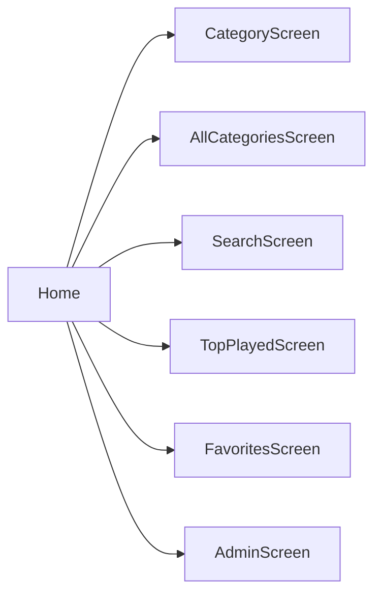

# Tela: Home (Início)

| Campo | Valor |
|-------|-------|
| Arquivo | `lib/screens/home_screen.dart` |
| Scaffold | `StreamingScaffold` (`navContext: home`) |
| Estado capturado | Preenchido — grid + empty “Mais Tocados” |
| Screenshot | 2026-05-31 |
| Confiança | 🟢 CONFIRMADO |

## Propósito

Hub principal estilo streaming: saudação personalizada, categorias em destaque (até 4), preview do ranking e acesso rápido às demais áreas via bottom nav.

## Layout (de cima para baixo)

### Barra superior

| Elemento | Descrição |
|----------|-----------|
| Leading | Avatar circular (foto Google quando logado) |
| Título | **“FMA Pontos”** — verde, bold (`FontWeight.w900`) |
| Actions | Ícone sino (`notifications_outlined`) — outline branco |

### Hero (`_GreetingBanner`)

| Elemento | Descrição |
|----------|-----------|
| Fundo | Ilustração full-width (categoria/arte rotativa ou Preta Velha) |
| Texto | “Boa noite, Roberto” (dinâmico: Bom dia / Boa tarde / Boa noite + primeiro nome) |
| Estilo | Branco sobre imagem, canto inferior esquerdo |

### Seção “Categorias”

| Elemento | Descrição |
|----------|-----------|
| Cabeçalho | “Categorias” + ícone chevron direita |
| Ação chevron | `Navigator` → `AllCategoriesScreen` |
| Grid | 2×2, `CategoryCard` com arte WebP |
| Cards visíveis | Caboclos · Pretos Velhos · Ogum · Iemanjá |
| Tap card | `CategoryScreen(category)` |

🟢 Destaques vêm de `PlayStatsService.rankCategoriesByAccess` (limite 4).

### Seção “Mais Tocados”

| Elemento | Descrição |
|----------|-----------|
| Cabeçalho | “Mais Tocados” + chevron |
| Ação chevron | `TopPlayedScreen` |
| Empty (capture) | “Nenhum ponto tocado ainda” — cinza |
| Preenchido (código) | Até 8 itens `LyricWithStats` em lista horizontal/vertical |

## Bottom navigation

| Índice | Label | Ícone | Estado no screenshot |
|--------|-------|-------|----------------------|
| 0 | Início | `home_rounded` | **Ativo** (verde) |
| 1 | Buscar | `search_rounded` | Inativo |
| 2 | Top | `trending_up_rounded` | Inativo |
| 3 | Gostei | `favorite_outline_rounded` | Inativo |
| 4 | Admin | `admin_panel_settings_rounded` | Inativo (visível só para admin) |

🟡 Usuário não-admin: slot 4 = **Categoria** (`add_circle_outline`) → dialog nova categoria.

## Interações (código, não no print)

- Pull-to-refresh implícito via sync no `initState`
- Back duplo na root → “Pressione novamente para sair”
- Avatar → `showAppInfoBottomSheet` (login, tema, versão)
- `UpdateService` checa release GitHub

## Estados

| Estado | Visual |
|--------|--------|
| Loading categorias | `CircularProgressIndicator` |
| Sem categorias | “Nenhuma categoria encontrada…” |
| Sem plays | “Nenhum ponto tocado ainda” (capture) |
| Offline | Ícone `wifi_off` na app bar (código) |

## Navegação

