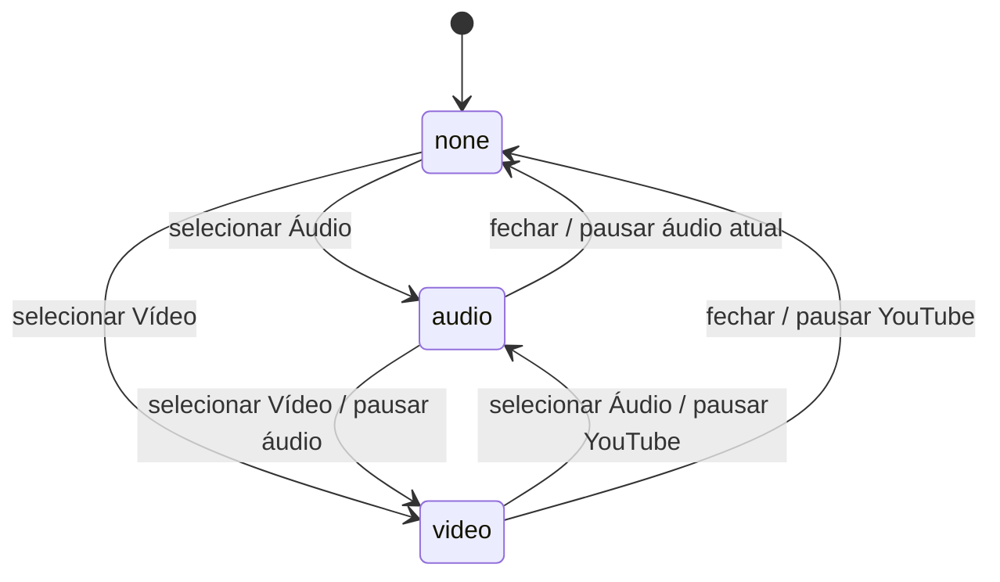
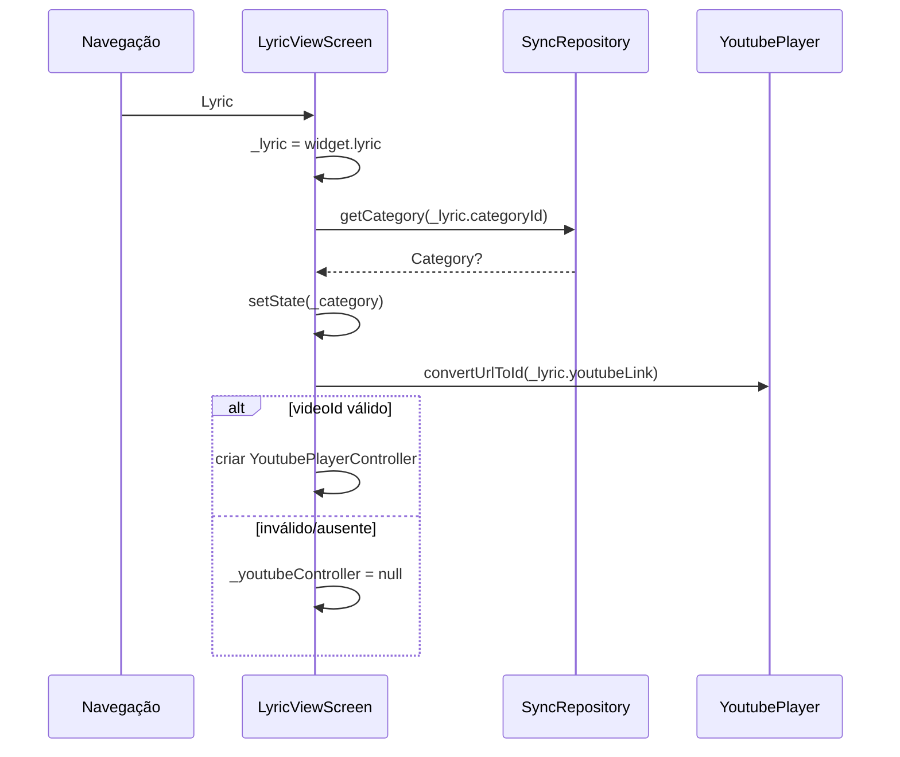
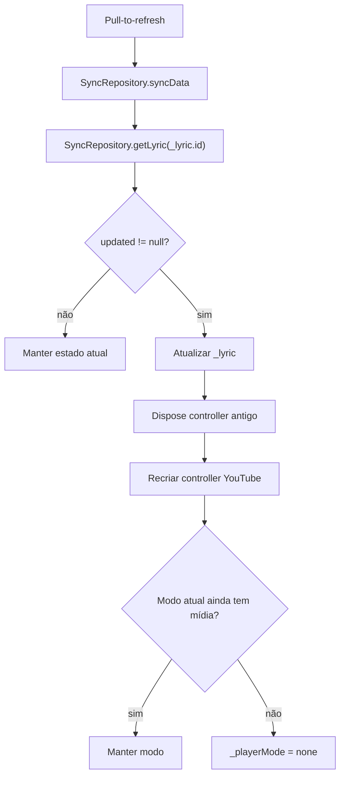
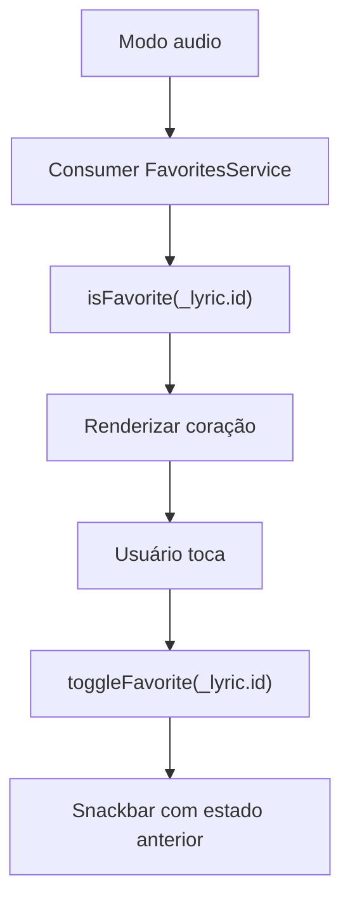

# Visualização de Letra — Design

## Decisão Arquitetural

🟢 **CONFIRMADO** — `LyricViewScreen` é uma tela stateful de detalhe, responsável por coordenar estado local de apresentação, providers globais e players de mídia.  
🟢 **CONFIRMADO** — A tela não possui repository próprio: usa `SyncRepository`, `AudioPlayerService`, `FavoritesService` e `AuthService` já registrados no `Provider`.  
🟢 **CONFIRMADO** — A fonte inicial de dados é o objeto `Lyric` recebido por navegação; updates posteriores são buscados localmente por ID.

## Componentes

| Componente | Tipo | Responsabilidade | Dependências |
|------------|------|------------------|--------------|
| `LyricViewScreen` | `StatefulWidget` | Receber `Lyric` e criar estado de detalhe | `Lyric` |
| `_LyricViewScreenState` | Estado da tela | Controlar `_lyric`, `_category`, `_youtubeController` e `_playerMode` | Providers e YouTube |
| `SyncRepository` | Service | Carregar categoria, recarregar letra, sincronizar e excluir | SQLite/Supabase |
| `AudioPlayerService` | Service | Reproduzir áudio, pausar, buscar posição e expor estado atual | AudioService/just_audio |
| `FavoritesService` | Service | Alternar favorito local | SharedPreferences |
| `AuthService` | Service | Expor permissões de editar/excluir | Supabase Auth/RBAC |
| `YoutubePlayerController` | Controller externo | Controlar player YouTube embutido | `youtube_player_flutter` |
| `LyricFormScreen` | Tela destino | Editar a letra atual | `Lyric`, `categoryId` |

## Estado Local

```dart
late Lyric _lyric;
Category? _category;
YoutubePlayerController? _youtubeController;
_PlayerMode _playerMode = _PlayerMode.none;
```

### Contratos

- 🟢 **CONFIRMADO** — `_lyric` começa como `widget.lyric`.
- 🟢 **CONFIRMADO** — `_category` é opcional; a ausência não bloqueia renderização.
- 🟢 **CONFIRMADO** — `_youtubeController` só existe quando `youtubeLink` converte para ID válido.
- 🟢 **CONFIRMADO** — `_playerMode` controla exclusivamente qual mídia está visível.

## Máquina de Estado do Player



| Estado | UI | Observação |
|--------|----|------------|
| `none` | Botões de mídia e texto "Escolha um player..." | Só aparece quando há pelo menos uma mídia disponível. |
| `audio` | Play/pause, favorito, slider e tempos | Usa `AudioPlayerService`. |
| `video` | `YoutubePlayer` com controles | Usa `YoutubePlayerController`. |

## Inicialização



### Configuração YouTube

```dart
YoutubePlayerFlags(
  autoPlay: false,
  mute: false,
  enableCaption: true,
)
```

## Layout

| Região | Conteúdo | Regra |
|--------|----------|-------|
| `AppBar` | Referência e título, ações editar/excluir | Título usa código+sequência quando categoria carregada. |
| `RefreshIndicator` | Envolve o scroll principal | Permite sync e reload manual. |
| Área de mídia | Card com botões Áudio/Vídeo/Fechar e player selecionado | Só aparece se há áudio ou vídeo válido. |
| Aviso sem mídia | Card informativo | Aparece quando não há áudio nem vídeo válido. |
| Conteúdo | Texto completo da letra | Renderizado em painel central com largura máxima de 600. |

## Detecção de Mídia

```dart
final hasAudio =
  (_lyric.audioUrl?.trim().isNotEmpty ?? false) ||
  (_lyric.localAudioPath?.trim().isNotEmpty ?? false);

final canPlayVideo = _youtubeController != null;
```

Regras:

- 🟢 **CONFIRMADO** — A tela considera áudio disponível se existe URL remota ou caminho local.
- 🟢 **CONFIRMADO** — O serviço de áudio decide internamente como tocar a letra.
- 🟢 **CONFIRMADO** — Vídeo depende de controller válido, não apenas de string preenchida.

## Integração com Áudio

| Ação | Implementação | Resultado |
|------|---------------|-----------|
| Selecionar Áudio | `_youtubeController?.pause(); setState(_playerMode = audio)` | Exibe controles de áudio. |
| Play/pause | `_togglePlay()` chama `AudioPlayerService.play(_lyric)` | Inicia/reinicia reprodução da letra. |
| Slider | `audioService.seek(Duration(seconds: value.toInt()))` | Busca posição quando a letra atual coincide. |
| Fechar áudio | `togglePlayPause()` se áudio da letra está tocando | Pausa e volta para `none`. |
| Tempo | `_formatDuration(position/duration)` | Exibe `mm:ss`. |

## Integração com Vídeo

| Ação | Implementação | Resultado |
|------|---------------|-----------|
| Inicializar | `YoutubePlayer.convertUrlToId` + `YoutubePlayerController` | Cria controller se URL é válida. |
| Selecionar Vídeo | Pausa áudio se `audioService.isPlaying`, depois `setState(video)` | Evita áudio e vídeo simultâneos. |
| Renderizar | `YoutubePlayer(controller: _youtubeController!)` | Exibe vídeo com progresso, velocidade e fullscreen. |
| Fechar vídeo | `_youtubeController?.pause(); setState(none)` | Pausa vídeo e oculta player. |
| Dispose | `_youtubeController?.dispose()` | Libera recursos ao sair. |

## Refresh e Recarregamento



O mesmo bloco conceitual é usado após retorno da edição quando a tela não foi fechada.

## Edição e Exclusão

| Ação | Gate | Fluxo |
|------|------|-------|
| Editar | `AuthService.canEditLyrics` | Abre `LyricFormScreen(categoryId: _lyric.categoryId, lyric: _lyric)`. |
| Pós-edição com `result == true` | N/A | Fecha `LyricViewScreen`, interpretado como exclusão/remoção no formulário. |
| Pós-edição sem `true` | N/A | Recarrega letra local por ID e reinicializa mídia. |
| Excluir | `AuthService.canDeleteLyrics` | Abre confirmação, chama `SyncRepository.deleteLyric(_lyric.id)` e fecha tela. |

### Matriz de Ações no AppBar

| Permissão | Ação renderizada |
|-----------|------------------|
| Sem `canEditLyrics` e sem `canDeleteLyrics` | Nenhuma ação |
| `canEditLyrics` apenas | Botão editar |
| `canEditLyrics` + `canDeleteLyrics` | Botões editar e excluir |
| `canDeleteLyrics` sem edit | Botão excluir, embora a hierarquia normal torne esse caso improvável |

## Favoritos

🟢 **CONFIRMADO** — O botão de favorito aparece dentro do modo áudio.



Não há dependência de autenticação nem de sync remoto para favoritar.

## Estados de UI

| Estado | Critério | UI |
|--------|----------|----|
| Categoria carregada | `_category != null && code.isNotEmpty` | AppBar com código+sequência+título |
| Categoria ausente | `_category == null` ou `code.isEmpty` | AppBar com título apenas |
| Com mídia | `hasAudio || canPlayVideo` | Card de mídia com botões |
| Sem mídia | `!hasAudio && !canPlayVideo` | Card informativo |
| Áudio atual | `audioService.currentLyric?.id == _lyric.id` | Usa duração/posição reais |
| Outro áudio atual | `currentLyric` diferente | Duração/posição zeradas para esta tela |
| Sem permissão editorial | `!canEdit && !canDelete` | AppBar sem ações |

## Riscos e Trade-offs

| Risco | Impacto | Mitigação existente | Confiança |
|-------|---------|---------------------|-----------|
| Categoria não carregar | AppBar perde código de referência | Título cai para apenas a letra | 🟢 |
| URL YouTube inválida | Vídeo não aparece | `convertUrlToId` filtra antes de criar controller | 🟢 |
| Letra removida no refresh | Tela mantém estado antigo se `getLyric` retorna null | Sem tratamento explícito | 🟡 |
| Falha em `syncData` | Refresh pode terminar sem feedback específico | Sem catch/erro visível na tela | 🟡 |
| Falha em delete | Dialog fecha e tela pode fechar sem feedback de erro | Sem tratamento explícito na UI | 🟡 |
| Áudio/vídeo simultâneo | Experiência confusa | Pausas cruzadas ao alternar modo | 🟢 |
| Controller antigo após edição | Vídeo errado ou recurso preso | Dispose e recriação após recarregar letra | 🟢 |

## Rastreabilidade

| Requisito | Design |
|-----------|--------|
| RF-01 a RF-04 | Estado `_lyric`, `_category`, AppBar e painel textual |
| RF-05 a RF-07 | Detecção de mídia e layout com/sem mídia |
| RF-08 a RF-10 | Máquina `_PlayerMode` e pausas cruzadas |
| RF-11 a RF-12 | Integração com `AudioPlayerService` |
| RF-13 | Integração com `FavoritesService` |
| RF-14 | Integração com `YoutubePlayerController` |
| RF-15 a RF-16 | Refresh/reload e reinicialização de mídia |
| RF-17 a RF-20 | `Consumer<AuthService>` e matriz de ações |
| RF-21 | `dispose` do controller YouTube |

