# Visualização de Letra — Fluxos Operacionais

## Fluxo 1 — Abrir visualização da letra

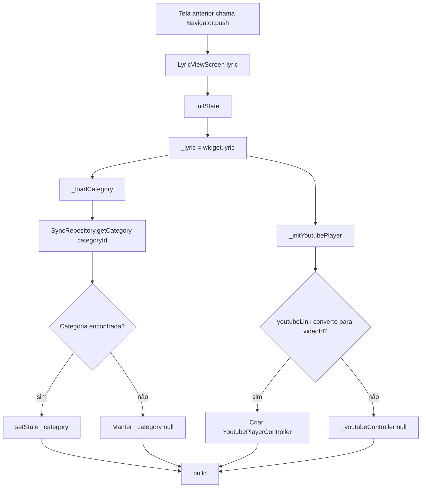

### Contrato do fluxo

- 🟢 **CONFIRMADO** — A tela recebe `Lyric` já resolvida da navegação.
- 🟢 **CONFIRMADO** — Categoria é carregada localmente, de forma assíncrona.
- 🟢 **CONFIRMADO** — Falha em carregar categoria não bloqueia a tela.
- 🟢 **CONFIRMADO** — Player YouTube só é criado se o link produzir ID válido.

## Fluxo 2 — Renderizar título e conteúdo

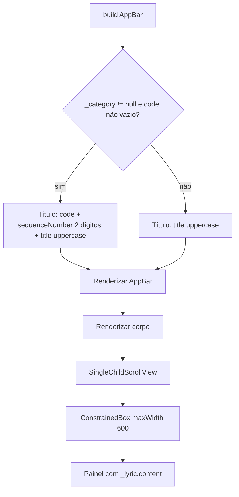

### Contrato do fluxo

- 🟢 **CONFIRMADO** — O conteúdo textual sempre vem de `_lyric.content`.
- 🟢 **CONFIRMADO** — A referência com código é enriquecimento visual, não dependência obrigatória.
- 🟢 **CONFIRMADO** — O título usa `sequenceNumber.toString().padLeft(2, '0')`.

## Fluxo 3 — Decidir disponibilidade de mídia

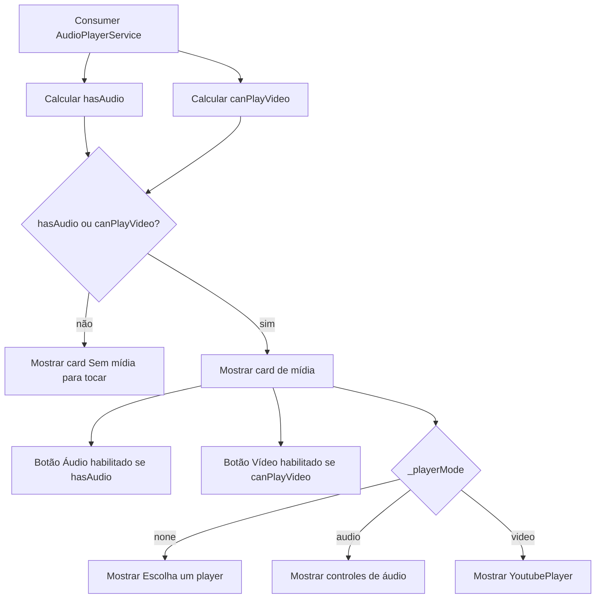

### Contrato do fluxo

- 🟢 **CONFIRMADO** — `hasAudio` exige `audioUrl` ou `localAudioPath` preenchido.
- 🟢 **CONFIRMADO** — `canPlayVideo` exige `_youtubeController != null`.
- 🟢 **CONFIRMADO** — Letra sem mídia mostra mensagem informativa em vez de botões desabilitados.

## Fluxo 4 — Selecionar e controlar áudio

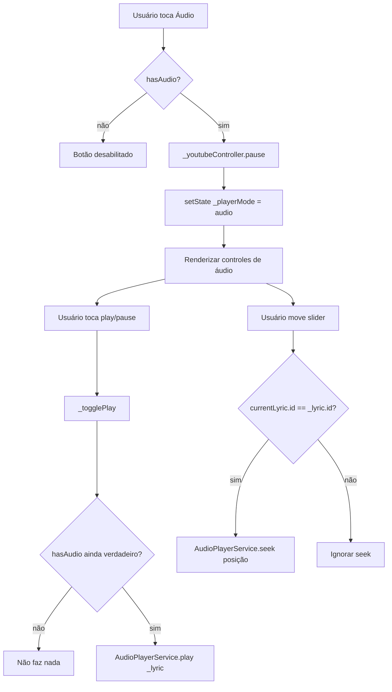

### Contrato do fluxo

- 🟢 **CONFIRMADO** — Selecionar áudio pausa YouTube.
- 🟢 **CONFIRMADO** — Play usa `AudioPlayerService.play(_lyric)`.
- 🟢 **CONFIRMADO** — Slider só busca posição quando a letra visualizada é a letra atual do serviço.
- 🟢 **CONFIRMADO** — Tempo é exibido no formato `mm:ss`.

## Fluxo 5 — Selecionar e controlar vídeo

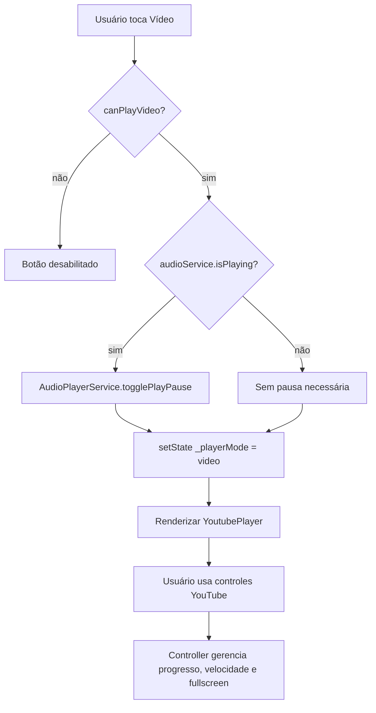

### Contrato do fluxo

- 🟢 **CONFIRMADO** — Selecionar vídeo pausa áudio quando algum áudio está tocando.
- 🟢 **CONFIRMADO** — O player usa controles de posição, barra de progresso, velocidade e fullscreen.
- 🟢 **CONFIRMADO** — URL inválida não cria controller e impede esse fluxo.

## Fluxo 6 — Fechar player ativo

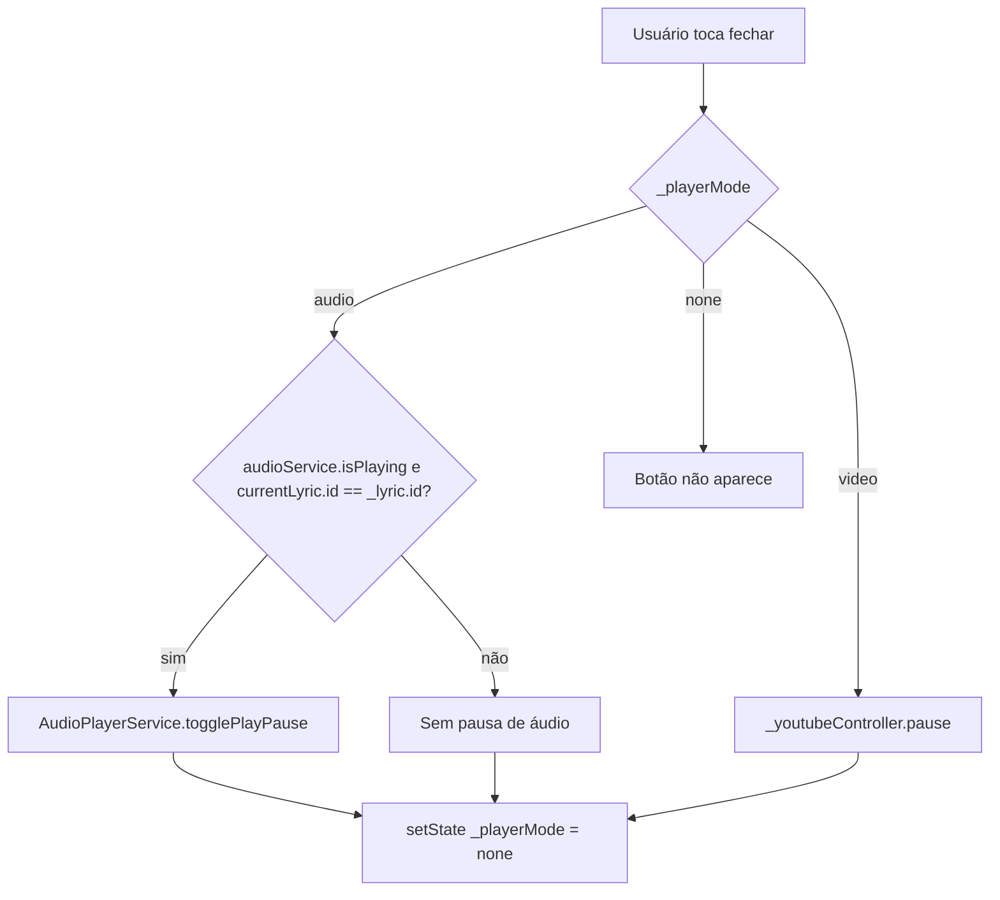

### Contrato do fluxo

- 🟢 **CONFIRMADO** — O botão fechar aparece apenas quando `_playerMode != none`.
- 🟢 **CONFIRMADO** — Fechar áudio pausa apenas se a letra visualizada é a que está tocando.
- 🟢 **CONFIRMADO** — Fechar vídeo pausa YouTube.

## Fluxo 7 — Favoritar no modo áudio

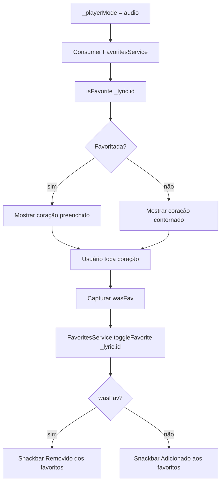

### Contrato do fluxo

- 🟢 **CONFIRMADO** — Favoritar usa estado local, sem RBAC.
- 🟢 **CONFIRMADO** — A mensagem depende do estado anterior.
- 🟢 **CONFIRMADO** — O botão aparece dentro dos controles de áudio.

## Fluxo 8 — Refresh manual da letra

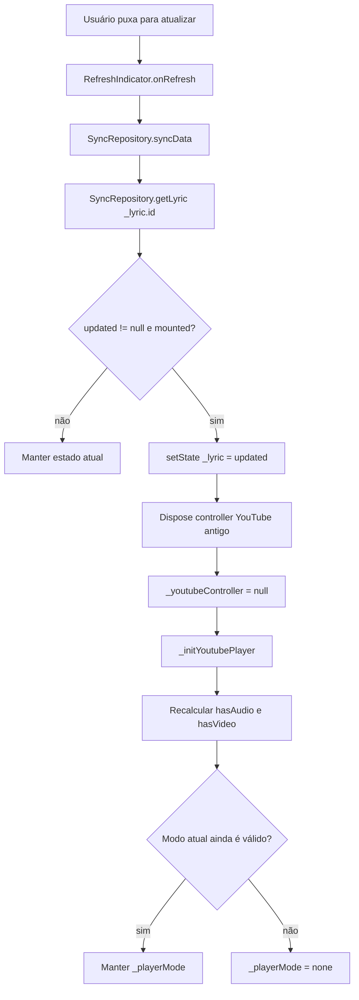

### Contrato do fluxo

- 🟢 **CONFIRMADO** — Refresh tenta sincronizar antes de recarregar a letra.
- 🟢 **CONFIRMADO** — A tela só atualiza se a letra recarregada existe.
- 🟢 **CONFIRMADO** — Controller YouTube é recriado após alteração.
- 🟢 **CONFIRMADO** — Modo de player inválido é fechado.
- 🟡 **INFERIDO** — Se a letra não existir mais, a tela não exibe aviso explícito.

## Fluxo 9 — Editar letra

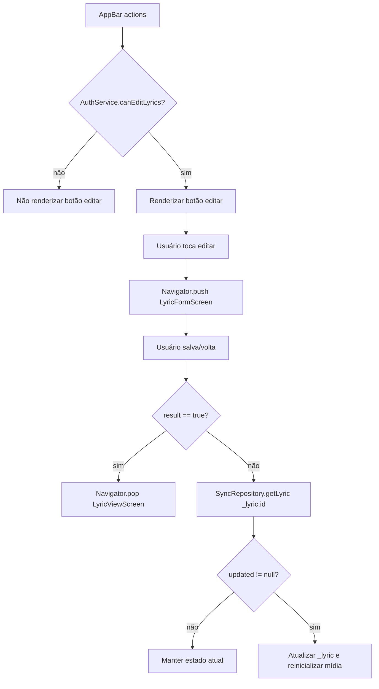

### Contrato do fluxo

- 🟢 **CONFIRMADO** — `moderator` e `admin` podem editar.
- 🟢 **CONFIRMADO** — Edição abre `LyricFormScreen` com o mesmo `categoryId` e a letra atual.
- 🟢 **CONFIRMADO** — Retorno `true` fecha a visualização.
- 🟢 **CONFIRMADO** — Retorno diferente de `true` recarrega a letra local.

## Fluxo 10 — Excluir letra

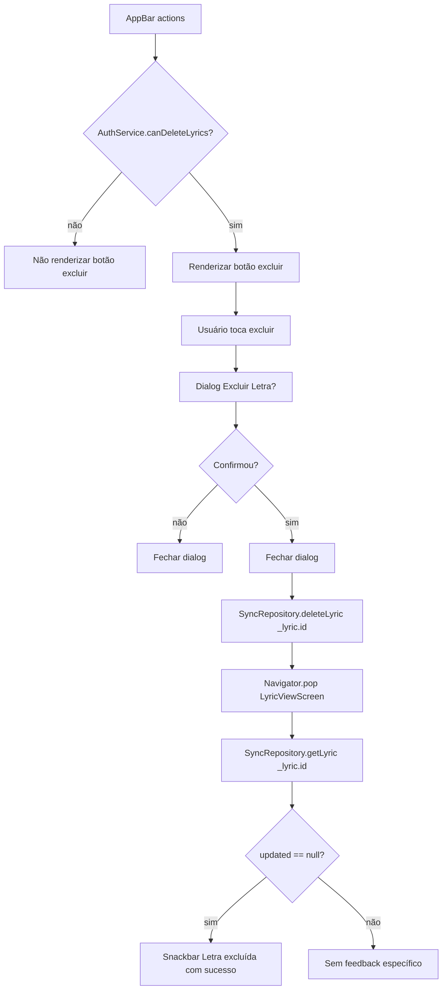

### Contrato do fluxo

- 🟢 **CONFIRMADO** — Apenas `admin` pode excluir pela UI.
- 🟢 **CONFIRMADO** — Exclusão exige confirmação.
- 🟢 **CONFIRMADO** — O repository cuida do delete local/remoto conforme sync.
- 🟡 **INFERIDO** — O feedback após `Navigator.pop` exige cuidado com `context.mounted` na reimplementação.

## Estados relevantes

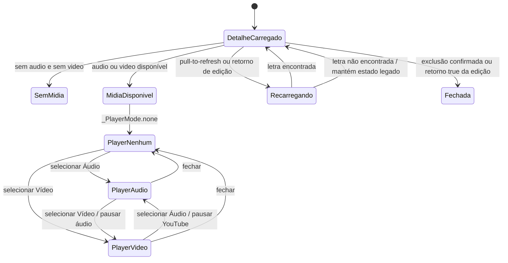

## Pontos de falha

| Falha | Comportamento legado | Confiança |
|---|---|---|
| Categoria não encontrada | AppBar usa apenas título da letra | 🟢 |
| YouTube inválido | Controller não é criado e botão vídeo fica indisponível | 🟢 |
| Sem áudio e sem vídeo | Mostra card informativo de ausência de mídia | 🟢 |
| Refresh retorna letra inexistente | Mantém estado atual, sem aviso específico | 🟡 |
| `syncData` falha | Não há tratamento explícito local na tela | 🟡 |
| Delete falha | Não há feedback específico de falha na tela | 🟡 |
| Edição remove mídia ativa | Modo volta para `none` se a mídia atual deixou de existir | 🟢 |
| Sair da tela com YouTube ativo | Controller é descartado no `dispose` | 🟢 |

## Lacunas

- 🟡 **INFERIDO** — Falhas de refresh/delete deveriam ter feedback explícito em uma reimplementação moderna.
- 🟡 **INFERIDO** — Se a letra é removida durante refresh, o legado não navega automaticamente para fora.
- 🟡 **INFERIDO** — O snackbar após exclusão pode depender de contexto já desmontado; reimplementar com mensageria no destino seria mais robusto.

